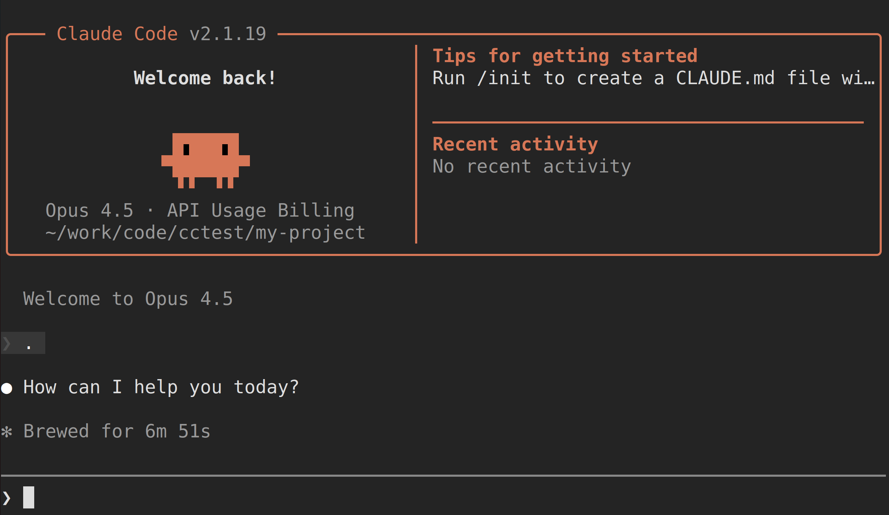

## 注册和充值

参考B站视频：

https://www.bilibili.com/video/BV1NfijByEJU/?spm_id_from=333.1387.upload.video_card.click

打开 jiekou AI 网站

https://jiekou.ai/

完成注册，邮箱验证，先小额充值，进行试用。

## 生成和设置 API key

进入 API 密钥管理，生成新的 API key。

然后参考 claudecode 的配置文档：

https://docs.jiekou.ai/docs/integration/claudecode

修改 .zshrc ，增加 cloud code 设置：

```bash
vi ~/.zshrc
```

如果固定使用某一种接口AI中转，可以简单增加以下内容：


```bash
# claude code
# jiekou ai forward
export ANTHROPIC_BASE_URL="https://api.jiekou.ai/anthropic"
export ANTHROPIC_AUTH_TOKEN="sk_Jscxxxxxxxxxxxxxxxxxxxxxxxxxxxxxxx"
export ANTHROPIC_MODEL="claude-opus-4-6"
export ANTHROPIC_SMALL_FAST_MODEL="claude-sonnet-4-5-20250929"
```

但考虑到可能需要切换不同的AI中转，最好还是使用 alias 来设置，方便切换：

```bash
# claude code
# jiekou ai forward
alias claudecode-jeikou='export ANTHROPIC_BASE_URL="https://api.jiekou.ai/anthropic";export ANTHROPIC_AUTH_TOKEN="sk_JscMPpl32zxxxxxxxxxxxxxxxxxxxxxxxxxxxxxxx";export ANTHROPIC_MODEL="claude-opus-4-6";export ANTHROPIC_SMALL_FAST_MODEL="claude-sonnet-4-5-20250929"'
# change to use default model of claude code
alias claudecode='claudecode-jeikou'
claudecode
```

载入：

```bash
source ~/.zshrc
```

## 使用 claude code

创建一个临时目录，然后进入该目录后，执行:

```bash
claude .
```



就可以开始使用 claude code 了。


