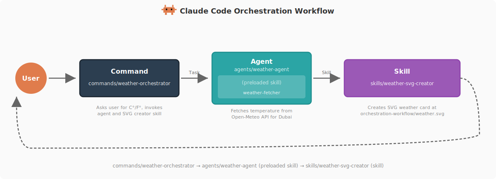

## 介绍

专门整理 Claude Code 的各种使用技巧和工作流，从入门到进阶全覆盖

https://github.com/shanraisshan/claude-code-best-practice

from vibe coding to agentic engineering - practice makes claude perfect

 Command →  Agent →  Skill pattern.



## 使用

```bash
mkdir -p ~/work/code/claude-code
cd ~/work/code/claude-code
wd add cc

git clone https://github.com/shanraisshan/claude-code-best-practice.git
```


## 资料

- [GitHub 上一路飙到 3.2 万 Star 的 Claude Code 最佳实践，开源了。](https://mp.weixin.qq.com/s?__biz=MzUxNjg4NDEzNA==&mid=2247532896&idx=1&sn=c169336edc44c424818ad55c3dd46138&chksm=f842e0aab2900bc35dbe3206e8436546d580050cab1ef12365e18b948832e90535001906b45f&mpshare=1&scene=1&srcid=0410XkPXBHd3vFGwSIV4wZ71&sharer_shareinfo=187c70e342da0ed6b422f28d30d3461f&sharer_shareinfo_first=187c70e342da0ed6b422f28d30d3461f&exportkey=n_ChQIAhIQhwUUriopjCfNfhzPTyiVDBKfAgIE97dBBAEAAAAAAArXGc%2BY8k8AAAAOpnltbLcz9gKNyK89dVj0iDjce6VPfJBsnBtaoKbYOKnLV9ClKllliQleXGXGBH8QskV7uURIQUSHOD9QTq%2BjD6SzeTTkKJLhOBaCUPVgEyYo2XOWbmcvHfEFq%2BPmvrwtzwWj30LN8aGM7wKtdx0keBB0PsrSEqxG%2BPhjM6vhupI7So8SdGNQlsEFnEy1fo7SQZyNdHOXXz8AGhNgDX56ayC4oFvnIaBABICAnezP8zN4aN8PbUv1Xi%2FVctytI7rdaHK1gO7bfxBQBkBLAasLMRJpvdV%2FM4QkoPt6eiKYGioJchyZKYEwIt2QZXmNyj6ap%2FqkmN6JdmLutNYEN4pOK9mU3Z2sEJyX&acctmode=0&pass_ticket=RdmC5KJepYsteelbyCVB8qmf9oqzrWoq%2BUJerUQ6fPmoqYFy812u0U1HwJ1zZykh&wx_header=0&poc_token=HO3j4Wmj14BqRysQY5orn3GvH3wrh52_FCgpOVIJ)

