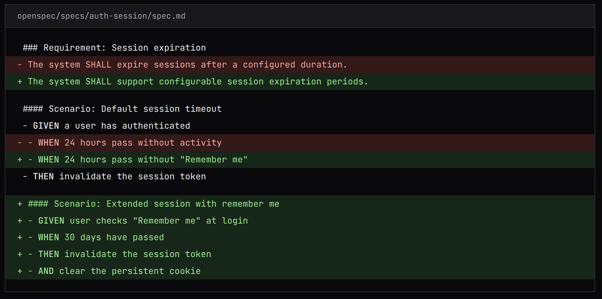
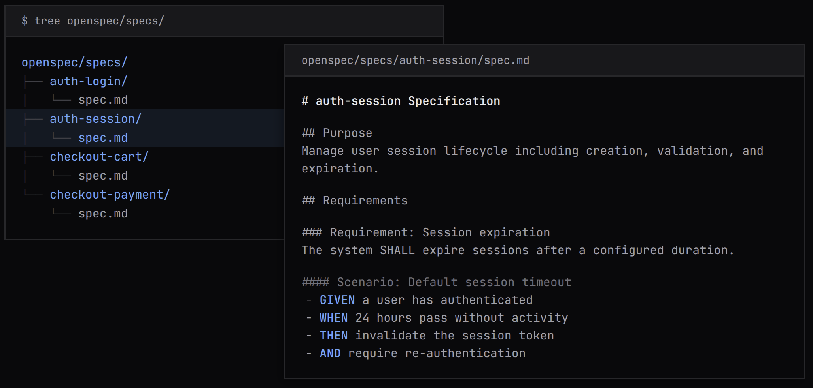
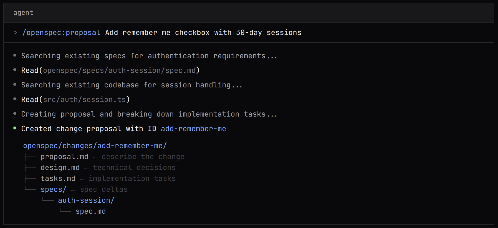

## 信息

https://github.com/Fission-AI/OpenSpec

https://openspec.dev/

## 介绍

openspec 是一个轻量化规格驱动型框架：

- Universal 通用
- Open Source  开源
- No API Keys  没有 API 密钥
- No MCP  无 MCP

## 支持的工具

原生支持：

- Claude Code
- Cursor
- Codex
- GitHub Copilot

还有其他工具：

- OpenCode
- Windsurf
- Gemini CLI
- Antigravity
- Cline
- RooCode
- Kilo Code 
- Amazon Q
- Qoder
- Auggie CLI
- Qwen Code
- CodeBuddy
- CoStrict
- Crush
- Factory Droid
- iFlow

> 备注： 比较关注的是 Gemini CLI / Antigravity / iFlow。

## 特征

### 审查意图，而不仅仅是代码

> Review intent, not just code

OpenSpec 的每次变更都会生成一个规范增量，用于记录系统需求的变化。这使得开发人员能够轻松理解他们如何修改系统以及需要更改哪些内容。同时，它也使审查人员无需深入代码即可了解变更本身，并快速获得高层次的理解。

### 持续存在的上下文

> Context that persists

您的规范文档与代码一起存放在代码仓库中，并按功能进行组织。当代理需要了解某个功能的工作方式时，它会读取规范文档。新开发人员加入时，他们可以浏览规范文档来了解系统。即使聊天会话结束或有人离开团队，规范文档也不会消失。

### 快速完成的review

> Something to review in seconds

当您描述想要进行的更改时，OpenSpec 会生成审查所需的一切：提案文档、分解的实现任务、技术设计决策以及规范变更表，该表展示了需求将如何变化。您可以在编写任何代码之前审查并完善计划，从而及早发现偏差。

### workspace (开发中)

OpenSpec 已成为许多开发人员首选的规划层。现在，我们正在为团队构建解决方案。

我们正在解决以下问题：

- Large codebases  大型代码库
- Multi-repo planning  多仓库规划
- Customization and integrations 定制和集成
- Better collaboration  更好的协作

## 常见问题解答

1. OpenSpec 与我的代理内置计划模式有何不同？

  计划模式非常适合单次聊天。我们更关注那些需要跨越多个会话或与他人共享的计划。功能规划工作区让您可以更好地进行规划，并随时进行调整。它贯穿整个开发生命周期，而不仅仅局限于一次对话。

2. OPENSPEC 与其他规划工具有何不同？

   - 轻量级。步骤最少，流程最简化。我们希望您能尽快开始搭建。

   - 先从现有系统入手。大多数工具都假设你是从零开始。我们则专注于成熟的代码库，因为真正的难点在于弄清楚现有系统是如何运作的。

   - 规范存在于您的代码中。其他工具仅在规划阶段使用需求，之后便将其丢弃。我们将功能需求保留在您的代码背后，作为动态文档，因此您始终了解代码应该做什么，而不仅仅是它当前正在做什么。

3. 我可以在现有代码库上使用 OpenSpec 吗？

   没错！规范是在构建过程中生成的。我们正在探索为现有代码库生成规范，但我们认为，试图预先生成所有规范是浪费时间。按需创建规范，然后逐步构建即可。

4. 当我在不同的编码代理之间切换时会发生什么？

   我们的目标是打造一个通用的规划层，无论您使用哪种编码代理，它都能伴您左右。编码代理日新月异，本月流行的可能下个月就过时了。但您的规范不应该受此影响。我们希望 OpenSpec 能够兼容所有编码代理。

5. 规格参数存放在哪里？

   在你的代码库中。我们认为应该将它们提交到代码库中——它们能让你了解系统的工作原理以及构建系统的初衷。

6. 团队如何共享和协作制定规范？

   规范和变更都记录在代码中，因此我们建议团队通过 Git 进行协作——提交 PR、代码审查以及遵循常规工作流程。我们正在为复杂场景（例如大型代码库、多仓库系统和微服务）构建更强大的团队协作功能。如果您正面临这些挑战，欢迎联系我们。

7. 等等，这不就是瀑布吗？

   瀑布式开发失败的原因在于僵化的计划和数月的预先规划。而我们的方法并非如此。我们希望你制定一个足够完善的计划，然后立即开始编码——以最小的努力，最轻量级的流程。你永远不可能制定出完美的计划，因为总会有未知因素。但这并不意味着你不应该花十分钟仔细思考。如果情况发生变化怎么办？更新规范，然后继续推进。

8. 我是一名氛围程序员——这个工具适合我吗？

   说实话？这要看情况。如果你想要的是一个能帮你规划一切而不费吹灰之力的神奇工具，那它并不适合你。规范只有在你认真阅读、仔细思考并付诸实践的情况下才能发挥作用。这是一个帮助你打造正确产品的工具——但只有当你积极参与其中时，它才能发挥最佳效果。

