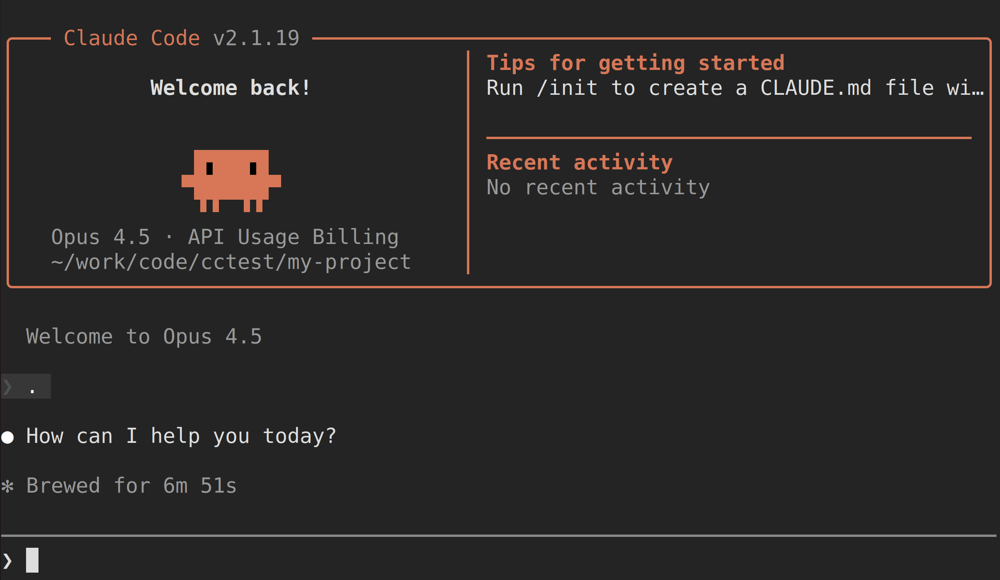
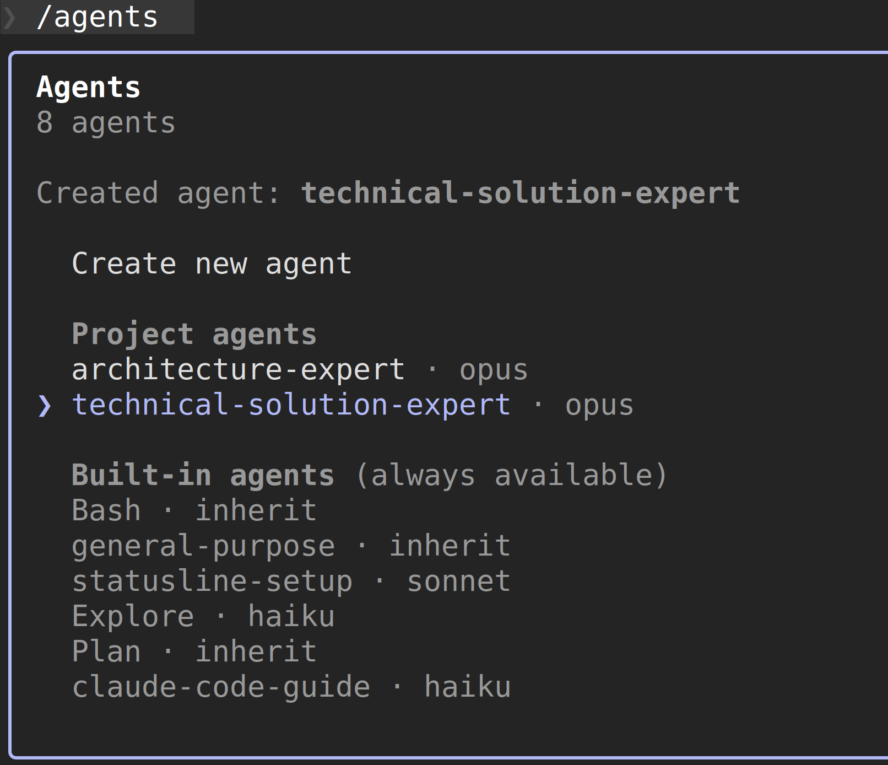

## 参考资料

- [多 AI 协同 + SDD 编程实践：一个 AI 全流程交付实录](https://developer.aliyun.com/article/1708977?spm=a2c6h.24874632.expert-profile.25.16451bb6OOAqyk)

- [AI编码实践：从Vibe Coding到SDD](https://developer.aliyun.com/article/1709229?spm=a2c6h.24874632.expert-profile.19.16451bb6OOAqyk)

## 搭建

参考第一篇文档，搭建 SDD 开发环境，整合 Claude Code / CodeX / Gemini，SDD 工具选择 OpenSpec。

### OpenSpec安装

```bash
npm install -g @fission-ai/openspec@latest
```

验证安装：

```bash
$ openspec --version
1.0.2
```

创建一个测试项目，如 

```bash
mkdir -p ~/work/code/cctest/my-project
cd ~/work/code/cctest/my-project
```

初始化项目：

```bash
openspec init
```

第一步选择tools（工具），我这里选择 claude code， 按 tab 确认。

```bash
openspec init     
Note: OpenSpec collects anonymous usage stats. Opt out: OPENSPEC_TELEMETRY=0
✔ Select tools to set up (21 available) Claude Code
▌ OpenSpec structure created
✔ Setup complete for Claude Code

OpenSpec Setup Complete

Created: Claude Code
10 skills and 10 commands in .claude/
Config: openspec/config.yaml (schema: spec-driven)

Getting started:
  /opsx:new       Start a new change
  /opsx:continue  Create the next artifact
  /opsx:apply     Implement tasks

Learn more: https://github.com/Fission-AI/OpenSpec
Feedback:   https://github.com/Fission-AI/OpenSpec/issues

Restart your IDE for slash commands to take effect.
```

当前项目下会新建一个openspec目录：

```bash
my-project tree
.
└── openspec
    ├── changes
    │   └── archive
    ├── config.yaml
    └── specs
```

### claude 安装和配置

初始化当前项目：

```bash
cd ~/work/code/cctest/my-project
claude .
```



继续在 Claude 中创建 SubAgent，执行 `/agents` 命令，选择  create agent，然后 location 选择 project （测试验证用，以后需要共用时可以选择 personal），create method 选择 generate with claude。Description 这里参考第一篇文章的样例，可以输入 "architecture-expert: 当需要生成项目说明文档时，调用这个agent", 或者 "technical-solution-expert：当需要将业务需求转化为详细技术方案时，调用这个agent"。

然后会显示 Generating agent from description..."，等待完成后，提示 select tools，默认全选。选择颜色，然后最后按 s 或者 回车 确认，或者 e 进行编辑。



### codex cli 安装

```bash
npm i -g @openai/codex
```

安装后检测：

```bash
$ codex --version
codex-cli 0.92.0
```

### 安装 uv

```bash
curl -LsSf https://astral.sh/uv/install.sh | sh
```

安装后检测：

```bash
$ uv --version
uv 0.9.28
```

### CodeX MCP 安装配置

移除官方 Codex MCP（如果已安装）:

```bash
claude mcp remove codex
```

安装 CodexMCP:

```bash
claude mcp add codex -s user --transport stdio -- uvx --from git+https://github.com/GuDaStudio/codexmcp.git codexmcp
```

验证安装：

```bash
claude mcp list
```

如果安装成功，则会显示：

```bash
Checking MCP server health...

codex: uvx --from git+https://github.com/GuDaStudio/codexmcp.git codexmcp - ✓ Connected
```

注意：一定要先安装 uv，否则这里会报错：

```bash
Checking MCP server health...

codex: uvx --from git+https://github.com/GuDaStudio/codexmcp.git codexmcp - ✗ Failed to connect
```