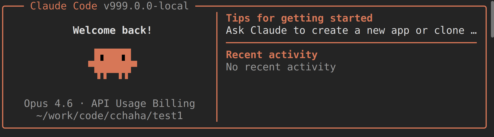
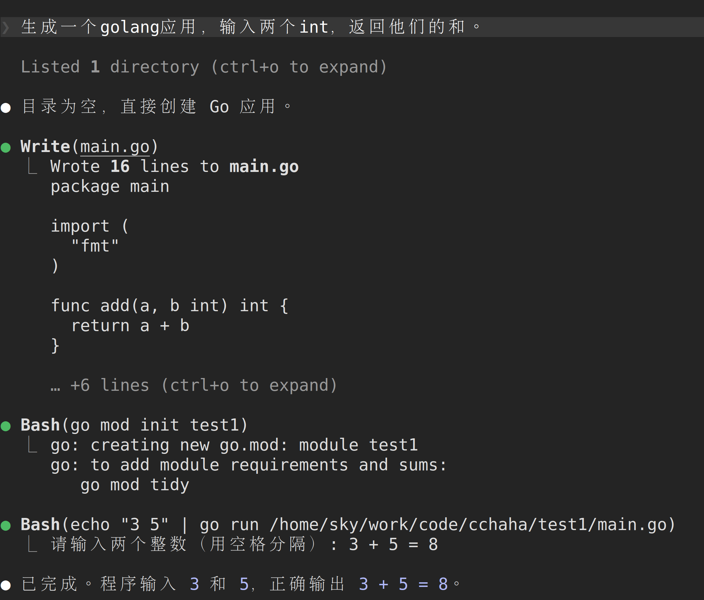

## 背景

原始代码据说不能直接运行，因此找到了一个修复版本：

https://github.com/NanmiCoder/cc-haha

基于 Claude Code 泄露源码修复的本地可运行版本，支持接入任意 Anthropic 兼容 API（如 MiniMax、OpenRouter 等）。

> 原始泄露源码无法直接运行。本仓库修复了启动链路中的多个阻塞问题，使完整的 Ink TUI 交互界面可以在本地工作。

修复的内容见：

https://github.com/NanmiCoder/cc-haha/blob/main/docs/reference/fixes.md

## 构建

先安装 bun，在 linux 下执行：

```bash
curl -fsSL https://bun.sh/install | bash
```

执行 source 让 bun 可用：

```bash
source ~/.zshrc
bun --version  
1.3.11
```

然后进入代码目录：

```bash
cd ~/work/code/claude-code-source/cc-haha
```

执行构建：

```bash
bun install
```

输出为：

```bash
bun install v1.3.11 (af24e281)

+ vitepress@1.6.4
+ vue@3.5.32
+ @anthropic-ai/sandbox-runtime@0.0.44
+ @anthropic-ai/sdk@0.80.0
+ @aws-sdk/client-bedrock-runtime@3.1020.0
+ @commander-js/extra-typings@14.0.0
+ @growthbook/growthbook@1.6.5
+ @modelcontextprotocol/sdk@1.29.0
+ @opentelemetry/api-logs@0.214.0
+ @opentelemetry/core@2.6.1
+ @opentelemetry/resources@2.6.1
+ @opentelemetry/sdk-logs@0.214.0
+ @opentelemetry/sdk-metrics@2.6.1
+ @opentelemetry/sdk-trace-base@2.6.1
+ @opentelemetry/semantic-conventions@1.40.0
+ ajv@8.18.0
+ asciichart@1.5.25
+ auto-bind@5.0.1
+ axios@1.14.0
+ bidi-js@1.0.3
+ chalk@5.6.2
+ chokidar@5.0.0
+ cli-boxes@4.0.1
+ code-excerpt@4.0.0
+ diff@8.0.4
+ emoji-regex@10.6.0
+ env-paths@4.0.0
+ execa@9.6.1
+ figures@6.1.0
+ fuse.js@7.1.0
+ get-east-asian-width@1.5.0
+ google-auth-library@10.6.2
+ highlight.js@11.11.1
+ https-proxy-agent@8.0.0
+ ignore@7.0.5
+ indent-string@5.0.0
+ ink@6.8.0
+ jsonc-parser@3.3.1
+ lodash-es@4.17.23
+ lru-cache@11.2.7
+ marked@17.0.5
+ medium-zoom@1.1.0
+ p-map@7.0.4
+ picomatch@4.0.4
+ proper-lockfile@4.1.2
+ qrcode@1.5.4
+ react@19.2.4
+ react-reconciler@0.33.0
+ semver@7.7.4
+ shell-quote@1.8.3
+ signal-exit@4.1.0
+ stack-utils@2.0.6
+ strip-ansi@7.2.0
+ supports-hyperlinks@4.4.0
+ tree-kill@1.2.2
+ type-fest@5.5.0
+ undici@7.24.6
+ usehooks-ts@3.1.1
+ vscode-jsonrpc@8.2.1
+ vscode-languageserver-types@3.17.5
+ wrap-ansi@10.0.0
+ ws@8.20.0
+ xss@1.0.15
+ yaml@2.8.3
+ zod@4.3.6

483 packages installed [6.33s]
Removed: 2
```

构建完成后，在 bin 目录下有生成的 claude-haha 二进制文件：

```bash
$ ls -lh ./bin
total 4.0K
-rwxrwxr-x 1 sky sky 511 Apr  8 14:19 claude-haha
```

## 配置

配置优先级：环境变量 > .env 文件 > ~/.claude/settings.json

我因为本地也跑官方的 claude code，相关的设置放在环境变量中，因此这里不单独设置 .env 文件了，直接用同一套 claude code 配置。

如果要配置 .env 文件，可以参考：

https://claudecode-haha.relakkesyang.org/guide/env-vars.html

## 启动

为了方便启动，将 cc-haha/bin 目录加入到 PATH 中：

```bash
vi ~/.zshrc
```

增加内容：

```bash
# claude code haha
export PATH="/home/sky/work/code/claude-code-source/cc-haha/bin:$PATH"
```

执行 source 生效：

```bash
source ~/.zshrc
```

查看版本，这里版本输出看来是修改过而且写死的：

```bash
claude-haha --version
999.0.0-local (Claude Code)
```

建立一个空目录，作为测试项目，然后在这个目录下启动 laude-haha：

```bash
mkdir -p work/code/cchaha/test1
cd work/code/cchaha/test1

laude-haha .
```

启动的 claude code 界面如下， 可以看到我配置的是使用 anthropic/claude-opus-4.6 模型：



输入 “生成一个golang应用，输入两个int，返回他们的和”， 然后让 claude code 生成一个简单的 golang 应用：



顺利完成， 证明本地构建的 clause code 基本功能可用。


