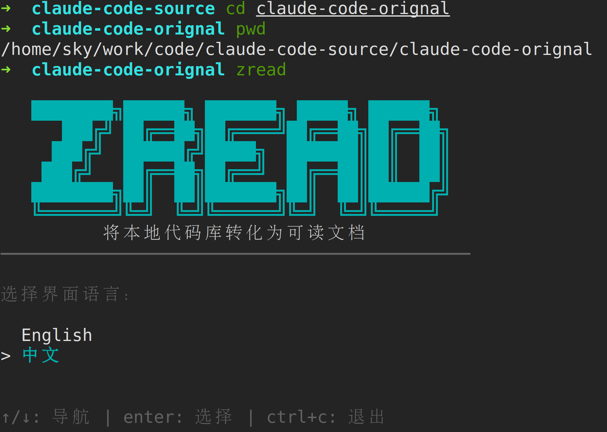
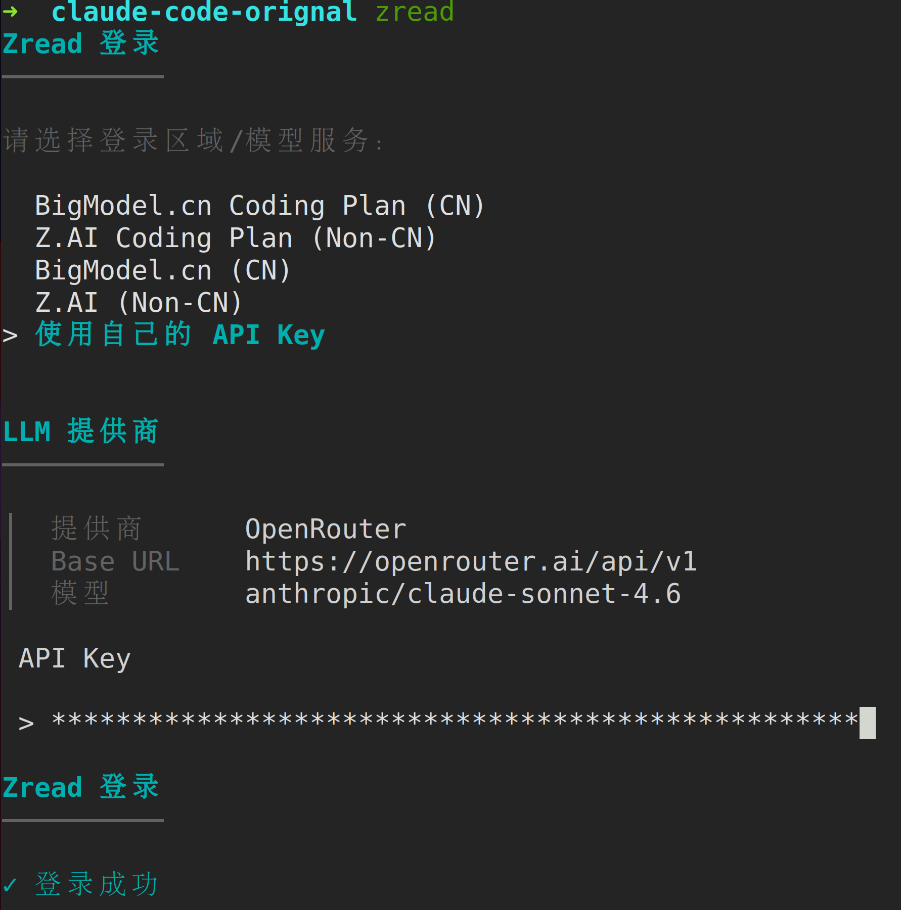
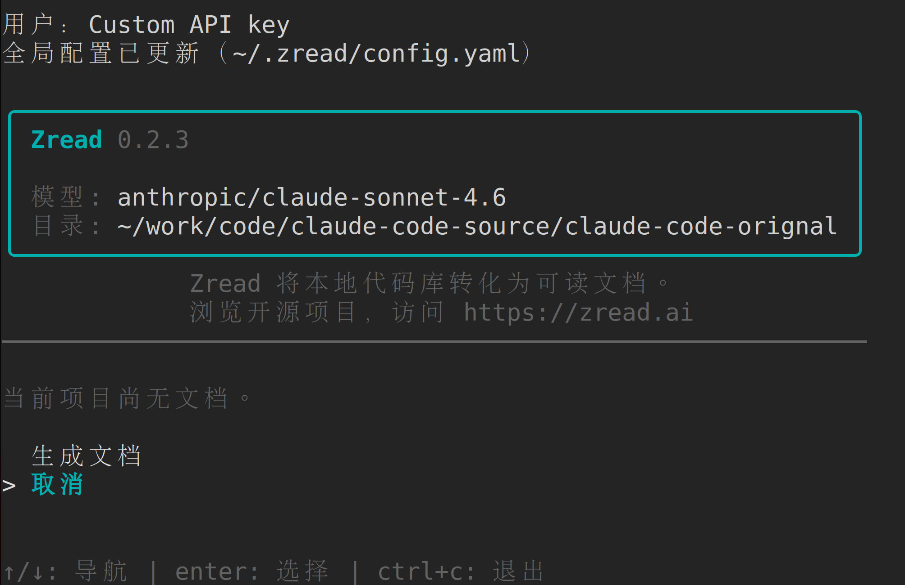

## 背景

看到这个文章：

https://zhuanlan.zhihu.com/p/2023408670394839255

## zread 介绍

https://zread.ai/

Zread CLI 是智谱 AI 推出的命令行工具，能自动分析项目代码，然后生成一份结构清晰、超级全面的项目文档。

Zread CLI 面向本地代码库场景，帮助开发者在本地目录中直接生成项目文档。

https://zread.ai/cli

## 安装 zread cli

```bash
npm install -g zread_cli
```

## 使用 zread cli

进入 claude-code 源码目录：

```bash
cd ~/work/code/claude-code-source/claude-code-orignal
zread
```

界面中选择中文:



### 登录

我选择使用自己的 API key， zread 支持 openai 兼容的模型，选择自定义，输入 apikey等信息，比如我选择用 jiekou.ai 做中转使用 claude-sonnet-4-6：


- model: claude-sonnet-4-6
- api_key: sk_Jsxxxxxxxxxxxxx
- base_url: https://api.jiekou.ai/openai/v1

注意：这里的 base_url 要在末尾增加 /v1 ，否则会报错 

```bash
LLM call failed after 4 attempts: POST "https://api.jiekou.ai/openai/chat/completions": 404 Not Found
```

之后提示：



显示登录成功：



配置文件存放在 `~/.zread/config.yaml` 中，如果要重设 zread，可以删除这个配置文件再启动 zread。

### 生成文档

选择 生成文档，不知道为什么非常慢，而且老是出错。

TODO： 待更新。


